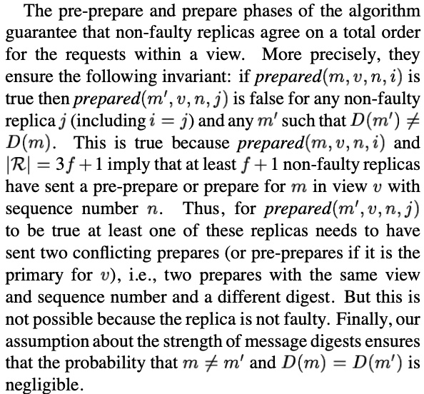
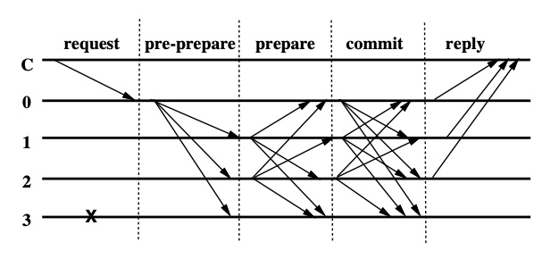

# PBFT
## Practical Byzantine Fault Tolerance

### Thus, the paper makes the following contributions:

1. It describes the first state-machine replication protocol that correctly survives Byzantine faults in asynchronous networks.

2. It describes a number of important optimizations that allow the algorithm to perform well so that it can be used in real systems.
3. It describes the implementation of a Byzantine-fault- tolerant distributed file system.
4. It provides experimental results that quantify the cost of the replication technique.

We use a Byzantine failure model, i.e., faulty nodes may behave arbitrarily, subject only to the restriction mentioned below. 
We assume independent node failures. For this assumption to be true in the presence of malicious attacks, some steps need to 
be taken, e.g., each node should run different implementations of the service code and operating system and should have a 
different root password and a different administrator. It is possible to obtain different implementations from the same code
base and for low degrees of replication one can buy operating systems from different vendors. N-version programming, i.e., 
different teams of programmers produce different implementations, is another option for some services.

